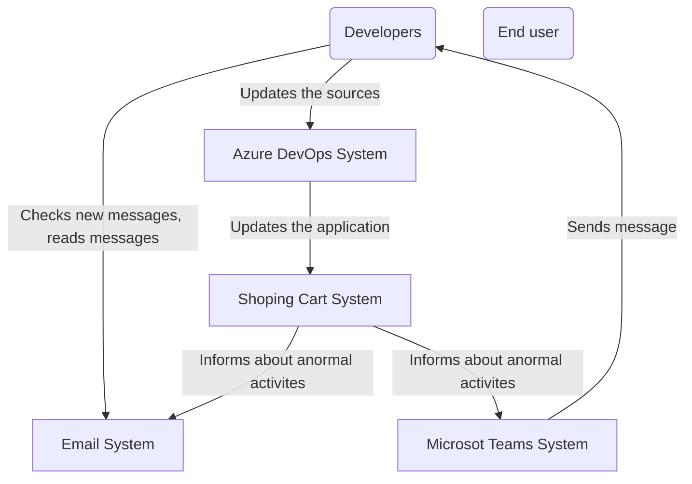
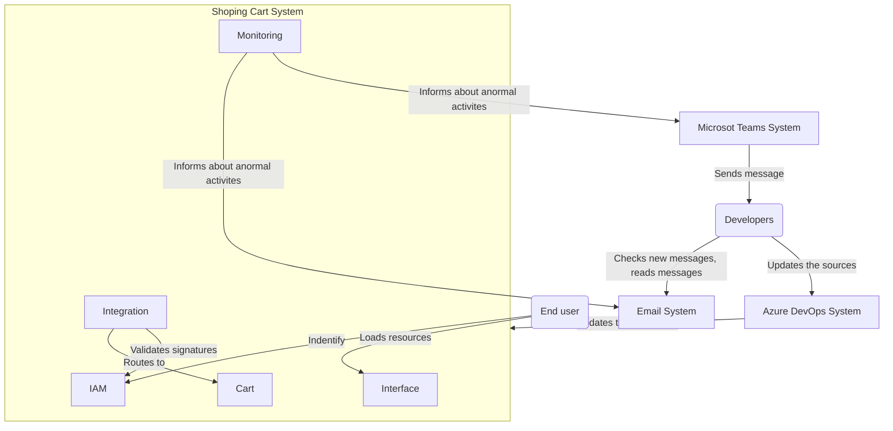

# Shopping Cart DevOps Demo

[](https://dev.azure.com/shopping-cart-devops-demo/shopping-cart-devops-demo/_build/latest?definitionId=1&branchName=develop)

Something (simple) you can demonstrate to showcase the Microsoft Azure DevSecOps ecosystem.

Features:

- [x] 0 trust (= no static credentials, only managed identities by Azure AD)
- [x] Chaos engineering with [Azure Chaos Studio](https://azure.microsoft.com/en-us/products/chaos-studio/)
- [x] DAST tests
- [ ] Integration layer with [Azure API Management](https://azure.microsoft.com/en-us/products/api-management)
- [ ] Integration tests
- [ ] OpenID authentication with a Progressive Web App app
- [ ] SAST tests with [GitHub Advanced Security](https://docs.azdevops.com/en/get-started/learning-about-azdevops/about-azdevops-advanced-security)
- [x] Serverless architecture
- [x] Stress tests with [Azure Load Testing](https://azure.microsoft.com/en-us/products/load-testing)
- [ ] Unit tests
- [x] DevOps integration with Microsoft 365 and Azure ecosystems

## General

### Pre-requisites

Make sure you have installed:

- [Microsoft Azure CLI](https://azdevops.com/Azure/azure-cli)
- [Kubernetes CLI](https://azdevops.com/kubernetes/kubectl)
- [Microsoft Azure Kubernetes credential CLI plugin](https://azdevops.com/Azure/kubelogin)
- [Helm CLI](https://azdevops.com/helm/helm)

### Setup

#### Defender for Containers

[Make sure the option is enabled from the web interface](https://learn.microsoft.com/en-us/azure/defender-for-cloud/defender-for-containers-enable?tabs=aks-deploy-portal%2Ck8s-deploy-asc%2Ck8s-verify-asc%2Ck8s-remove-arc%2Caks-removeprofile-api&pivots=defender-for-container-aks#enable-the-plan).

#### Azure Container Registry

```bash
# Create the Azure Container Registry
az acr create \
    --location westeurope \
    --name shoppingcartdevopsdemo \
    --resource-group shopping-cart-devops-demo \
    --sku Basic \
    --workspace shopping-cart-devops-demo
```

#### Kubernetes

Create the [Azure Kubernetes Service documentation](https://learn.microsoft.com/en-us/azure/aks)):

```bash
# TBD
```

Install the Ingress, [Traefik](https://traefik.io/):

```bash
helm repo add traefik https://traefik.github.io/charts

helm repo update

kubectl create ns traefik

helm upgrade \
  --atomic \
  --install \
  --namespace=traefik \
  --version=20.8.0 \
  traefik \
  traefik/traefik
```

Enable [Defender for Cloud inside Azure Kubernetes Service](https://learn.microsoft.com/en-us/azure/defender-for-cloud/defender-for-containers-enable?tabs=k8s-deploy-cli%2Ck8s-deploy-asc%2Ck8s-verify-asc%2Ck8s-remove-arc%2Caks-removeprofile-api&pivots=defender-for-container-aks#use-azure-cli-to-deploy-the-defender-extension):

```bash
az feature register \
  --namespace Microsoft.ContainerService \
  --name AKS-AzureDefender

az aks update \
  --enable-defender \
  --name shoppingcartdevopsdemo \
  --resource-group shopping-cart-devops-demo
```

Install Chaos Mesh ([Chaos Mesh documentation](https://chaos-mesh.org/docs/production-installation-using-helm/#verify-the-installation), [Azure Chaos Studio documentation](https://learn.microsoft.com/en-us/azure/chaos-studio/chaos-studio-tutorial-aks-portal#set-up-chaos-mesh-on-your-aks-cluster)) for Kubernetes:

```bash
kubectl create ns chaos-testing

helm install chaos-mesh chaos-mesh/chaos-mesh \
  --namespace=chaos-testing \
  --set chaosDaemon.runtime=containerd \
  --set chaosDaemon.socketPath=/run/containerd/containerd.sock \
  --version 2.5.1

az role assignment create --role "Cosmos DB Operator" --assignee-object-id $EXPERIMENT_PRINCIPAL_ID --scope $RESOURCE_ID
```

Enable [Workload Identity](https://learn.microsoft.com/en-us/azure/aks/workload-identity-deploy-cluster) to the Kubernetes cluster:

```bash
az feature register --namespace "Microsoft.ContainerService" --name "EnableWorkloadIdentityPreview"

az provider register --namespace Microsoft.ContainerService

az aks update \
  --name shoppingcartdevopsdemo \
  --resource-group shopping-cart-devops-demo \
  --enable-oidc-issuer \
  --enable-workload-identity

USER_ASSIGNED_IDENTITY_NAME="shopping-cart-devops-demo"
AKS_OIDC_ISSUER="$(az aks show --name shoppingcartdevopsdemo --resource-group shopping-cart-devops-demo --query "oidcIssuerProfile.issuerUrl" -otsv)"
USER_ASSIGNED_CLIENT_ID="$(az identity show --resource-group shopping-cart-devops-demo --name "${USER_ASSIGNED_IDENTITY_NAME}" --query 'clientId' -otsv)"
SERVICE_ACCOUNT_NAME="workload-identity-sa"
SERVICE_ACCOUNT_NAMESPACE="dev"

# You can repeat this step for all your namespaces (ex: dev, preprod, prod)
cat <<EOF | kubectl apply -f -
apiVersion: v1
kind: ServiceAccount
metadata:
  annotations:
    azure.workload.identity/client-id: "${USER_ASSIGNED_CLIENT_ID}"
  labels:
    azure.workload.identity/use: "true"
  name: "${SERVICE_ACCOUNT_NAME}"
  namespace: "${SERVICE_ACCOUNT_NAMESPACE}"
EOF

az identity federated-credential create \
  --name "sa-k8s-${USER_ASSIGNED_IDENTITY_NAME}-${SERVICE_ACCOUNT_NAMESPACE}-${SERVICE_ACCOUNT_NAME}" \
  --identity-name "${USER_ASSIGNED_IDENTITY_NAME}" \
  --resource-group "shopping-cart-devops-demo" \
  --issuer "${AKS_OIDC_ISSUER}" \
  --subject system:serviceaccount:"${SERVICE_ACCOUNT_NAMESPACE}":"${SERVICE_ACCOUNT_NAME}"
```

Install [KEDA](https://keda.sh/docs/2.9/deploy/):

```bash
SERVICE_ACCOUNT_NAMESPACE="keda"
SERVICE_ACCOUNT_NAME="keda-operator"

az identity federated-credential create \
  --name "sa-k8s-${USER_ASSIGNED_IDENTITY_NAME}-${SERVICE_ACCOUNT_NAMESPACE}-${SERVICE_ACCOUNT_NAME}" \
  --identity-name "${USER_ASSIGNED_IDENTITY_NAME}" \
  --resource-group "shopping-cart-devops-demo" \
  --issuer "${AKS_OIDC_ISSUER}" \
  --subject system:serviceaccount:"${SERVICE_ACCOUNT_NAMESPACE}":"${SERVICE_ACCOUNT_NAME}"

TENANT_ID=$(az account tenant list | jq -r '.[0].tenantId')

helm repo add kedacore https://kedacore.github.io/charts

helm repo update

kubectl create ns keda

helm upgrade \
  --install \
  --namespace keda \
  --set podIdentity.azureWorkload.enabled=true \
  --set podIdentity.azureWorkload.tenantId=${TENANT_ID} \
  --set podIdentity.azureWorkload.clientId=${USER_ASSIGNED_CLIENT_ID} \
  keda \
  kedacore/keda
```

#### Azure Load Testing

```bash
# ID of the Service Principal used by Azure DevOps
SERVICEPRINCIPAL_ID="da0107d7-2837-4ca1-a4c9-70f7b6d8aee1"

az role assignment create --assignee $SERVICEPRINCIPAL_ID \
  --role "Load Test Contributor"
```

## Architecture

See [C4 architecture model documentation](https://c4model.com).

### System context diagram



### Container diagram


